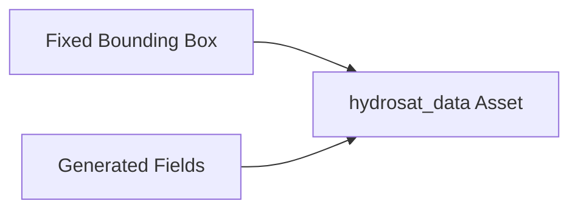
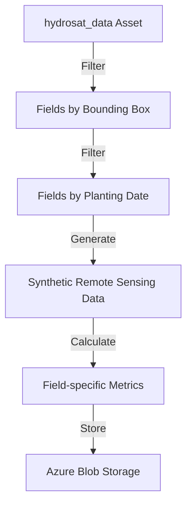
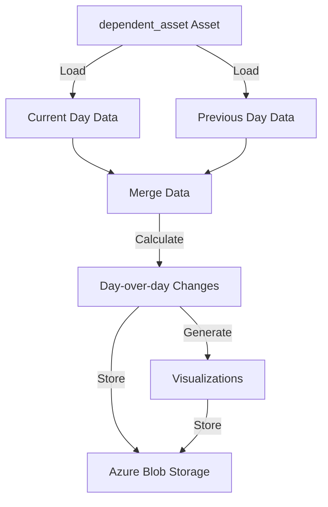

# 🏗️ System Architecture

This document details the architecture of the Hydrosat geospatial data processing pipeline.


## 🌐 Infrastructure Components

### Azure Kubernetes Service (AKS)

AKS serves as the primary compute platform for the pipeline, providing:

- **Containerized Workload Management**: Handles deployment, scaling, and operations of containerized applications
- **Scalability**: Automatically scales nodes based on workload demands
- **Pod Orchestration**: Manages the Dagster components and user code deployments

Configuration highlights:
```hcl
resource "azurerm_kubernetes_cluster" "aks" {
  name                = "${var.prefix}-aks"
  location            = var.location
  resource_group_name = azurerm_resource_group.rg.name
  dns_prefix          = "${var.prefix}aks"
  
  default_node_pool {
    name       = "agentpool"
    node_count = 2
    vm_size    = "Standard_D2s_v3"
  }

  identity {
    type = "SystemAssigned"
  }
}
```

### Azure Container Registry (ACR)

ACR stores and manages the container images for the data processing platform:

- **Image Repository**: Stores the Dagster application container
- **Integration with AKS**: Provides seamless image pulling for Kubernetes
- **Versioning**: Manages image versions with tags

Configuration highlights:
```hcl
resource "azurerm_container_registry" "acr" {
  name                = "${replace(var.prefix, "-", "")}acr"
  resource_group_name = azurerm_resource_group.rg.name
  location            = var.location
  sku                 = "Basic"
  admin_enabled       = true
}
```

### Azure Blob Storage

Azure Blob Storage provides the data lake functionality for the pipeline:

- **Input Storage**: Used for optional field definitions
- **Output Storage**: Stores processed data, metrics, and visualizations
- **Container Organization**: Separates inputs, outputs, and internal data

Configuration highlights:
```hcl
resource "azurerm_storage_account" "storage" {
  name                     = "${replace(var.prefix, "-", "")}storage"
  resource_group_name      = azurerm_resource_group.rg.name
  location                 = var.location
  account_tier             = "Standard"
  account_replication_type = "LRS"
}

resource "azurerm_storage_container" "inputs" {
  name                  = "inputs"
  storage_account_name  = azurerm_storage_account.storage.name
  container_access_type = "private"
}

resource "azurerm_storage_container" "outputs" {
  name                  = "outputs"
  storage_account_name  = azurerm_storage_account.storage.name
  container_access_type = "private"
}
```

## 🔄 Orchestration Layer

### Dagster

Dagster serves as the orchestration engine for the pipeline:

- **Asset Materialization**: Manages the creation and updating of data assets
- **Partitioning**: Handles time-based (daily) partitioning of data
- **Dependencies**: Manages inter-asset dependencies and execution order
- **UI**: Provides a web interface for monitoring and triggering runs

#### Dagster Deployment Components

The Dagster deployment in Kubernetes consists of:

1. **Dagster Webserver**: Web UI for interacting with the pipeline
2. **Dagster Daemon**: Background processes for scheduling and monitoring
3. **User Code Deployment**: Contains the pipeline code and runs materializations
4. **PostgreSQL**: Metadata storage for Dagster
5. **RabbitMQ**: Message queue for asynchronous operations

#### Helm Configuration

Dagster is deployed via Helm with custom configuration:

```yaml
dagsterWebserver:
  service:
    type: LoadBalancer

postgresql:
  enabled: true
  persistence:
    enabled: true
    size: 8Gi

rabbitmq:
  enabled: true
  persistence:
    enabled: true
    size: 8Gi

dagster-user-deployments:
  enabled: true
  deployments:
    - name: hydrosat-code
      image:
        repository: hydro0ba375acr.azurecr.io/hydrosat
        tag: latest
        pullPolicy: Always
      dagsterApiGrpcArgs:
        - "-m"
        - "hydrosat_project"
      port: 4000
      env:
        - name: AZURE_STORAGE_CONNECTION_STRING
          value: "DefaultEndpointsProtocol=https;AccountName=STORAGE_ACCOUNT_NAME;AccountKey=STORAGE_ACCOUNT_KEY;EndpointSuffix=core.windows.net"
        - name: AZURE_STORAGE_KEY
          value: "STORAGE_ACCOUNT_KEY"
```

## 📦 Pipeline Components

### Asset Definition Layer

The pipeline is built around two primary Dagster assets:

#### 1. hydrosat_data Asset

The `hydrosat_data` asset performs the primary data processing:

```python
@asset(
    partitions_def=daily_partitions,
    required_resource_keys={"azure_blob"}
)
def hydrosat_data(context: AssetExecutionContext):
    # Process data for the current partition (date)
    date = context.partition_key
    context.log.info(f"Processing data for date: {date}")
    bbox = box(10.0, 45.0, 11.0, 46.0)  # Fixed bounding box
    
    # Rest of processing logic
    # ...
```

**Responsibilities**:
- Using a fixed bounding box for the geographic region
- Handling field definitions (from storage or generating randomly)
- Filtering fields by bounding box intersection
- Filtering fields by planting date
- Generating synthetic remote sensing data (NDVI, soil moisture, temperature)
- Calculating field statistics
- Storing results and visualizations

#### 2. dependent_asset Asset

The `dependent_asset` performs change analysis between days:

```python
@asset(
    partitions_def=daily_partitions,
    deps=[AssetDep(hydrosat_data, partition_mapping=TimeWindowPartitionMapping(start_offset=-1, end_offset=-1))],
    required_resource_keys={"azure_blob"}
)
def dependent_asset(context: AssetExecutionContext):
    # Compare current day with previous day
    # ...
```

**Responsibilities**:
- Loading data from current and previous day
- Calculating day-over-day changes
- Computing percentage changes and growth rates
- Generating comparison visualizations
- Storing change analysis results

### Resource Layer

Resources provide the pipeline with access to external services:

#### Azure Blob Resource

```python
@resource(
    description="Azure Blob Storage client",
)
def azure_blob_resource(_):
    # Create and return an Azure Blob client
    # ...
```

**Responsibilities**:
- Creating authenticated client for Azure Blob Storage
- Providing container clients for input and output operations
- Handling connection string and authentication

#### IO Manager

```python
class SimplePickleIOManager(IOManager):
    """
    IO manager for Azure Blob Storage.
    """
    def __init__(self, blob_client, container_name):
        # Initialize with blob client
        # ...
```

**Responsibilities**:
- Managing data serialization/deserialization
- Storing asset outputs in Azure Blob Storage
- Loading asset inputs from Azure Blob Storage

## 🔄 Data Flow

The pipeline processes data in the following sequence:

### 1. Initial Setup



- Fixed bounding box defined in code (10.0, 45.0, 11.0, 46.0)
- Field definitions generated or loaded from file (`field_definitions.json`)

### 2. Geospatial Processing



- Fields filtered by intersection with bounding box
- Fields filtered by planting date (only process planted fields)
- Synthetic data generated for NDVI, soil moisture, and temperature
- Zonal statistics calculated for each field
- Results stored in Azure Blob Storage

### 3. Change Analysis



- Data loaded for current and previous day
- Data merged by field identifiers
- Changes calculated between days
- Growth rates and percentage changes computed
- Visualizations generated for each field
- Results stored in Azure Blob Storage

## 📊 Partitioning Strategy

The pipeline uses daily partitioning to organize data processing:

```python
# Define the daily partitions
daily_partitions = DailyPartitionsDefinition(start_date="2024-01-01")
```

### Partition Dependencies

Dependencies between partitions are managed using Dagster's `TimeWindowPartitionMapping`:

```python
deps=[AssetDep(hydrosat_data, 
      partition_mapping=TimeWindowPartitionMapping(
          start_offset=-1, 
          end_offset=-1
      ))]
```

This creates a sliding window where each day's `dependent_asset` depends on the previous day's `hydrosat_data`.

## 🔐 Security Considerations

The architecture implements several security measures:

### Authentication and Authorization

- **Azure AD Integration**: AKS integrates with Azure Active Directory
- **RBAC**: Role-based access control for Kubernetes resources
- **Managed Identities**: Used for service-to-service authentication

### Data Security

- **Storage Account Keys**: Securely managed and rotated
- **Connection Strings**: Stored as Kubernetes secrets
- **Private Access**: No public exposure of storage by default

### Container Security

- **Image Scanning**: Vulnerability scanning for container images
- **Private Registry**: ACR with restricted access
- **Resource Limits**: Defined resource boundaries for pods

## 📈 Scaling Considerations

The architecture is designed to scale in multiple dimensions:

### Horizontal Scaling

- **Node Pools**: AKS can add nodes to handle increased load
- **Container Instances**: Multiple pods can process data in parallel

### Vertical Scaling

- **VM Sizes**: Node VM sizes can be increased for memory-intensive operations
- **Resource Allocation**: Pod resource requests and limits can be adjusted

### Data Volume Scaling

- **Storage Tiers**: Azure Storage can scale to petabytes of data
- **Partition Granularity**: Partitioning strategy can be adjusted for data volume

## 📦 Storage Organization

The pipeline organizes data in Azure Blob Storage as follows:

### Input Container (Optional)

- `/field_definitions.json` - Field definitions (if used)

### Output Container

- `/hydrosat_data_YYYY-MM-DD.csv` - Daily raw data in CSV format
- `/hydrosat_data_YYYY-MM-DD.json` - Daily raw data in JSON format
- `/hydrosat_changes_YYYY-MM-DD.csv` - Day-over-day changes
- `/plots/ndvi_YYYY-MM-DD.png` - NDVI visualizations
- `/plots/soil_moisture_YYYY-MM-DD.png` - Soil moisture visualizations
- `/plots/temperature_YYYY-MM-DD.png` - Temperature visualizations
- `/plots/field_summary_fieldN_YYYY-MM-DD.png` - Field-specific visualizations

## 🔄 Future Extension Points

The architecture is designed for extensibility:

### Additional Data Sources

- **Real Satellite Data**: Replace synthetic data with actual satellite imagery
- **Weather Data**: Integrate with weather APIs for correlation analysis
- **Ground Sensors**: Incorporate IoT sensor data from fields

### Enhanced Analytics

- **Machine Learning**: Add ML models for prediction and anomaly detection
- **Time Series Analysis**: Implement advanced time series algorithms
- **Crop Yield Prediction**: Develop crop yield forecasting capabilities

### Integration Options

- **API Layer**: Add REST or GraphQL API for data access
- **BI Tools**: Connect to Power BI or Tableau for dashboarding
- **Data Warehouse**: Push results to a data warehouse for analytics

## 🔧 Development Workflow

The development workflow is designed for agility:

1. **Local Development**: Develop and test code locally
2. **Container Building**: Build and test Docker images
3. **Terraform Application**: Apply infrastructure changes
4. **Helm Deployment**: Deploy updated application
5. **Monitoring**: Verify through logs and metrics

## 🧪 Testing Strategy

The architecture supports comprehensive testing:

- **Unit Tests**: Test individual functions and components
- **Integration Tests**: Test interactions between components
- **End-to-End Tests**: Test the complete pipeline
- **Infrastructure Tests**: Validate the infrastructure setup

---

This architecture document provides a comprehensive overview of the Hydrosat geospatial data processing pipeline. It can be extended and refined as the system evolves.